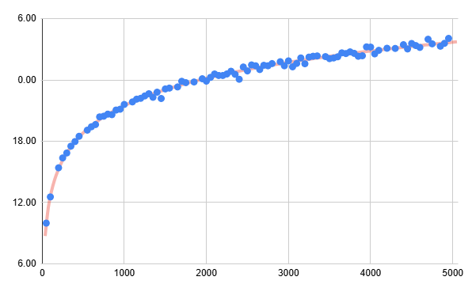
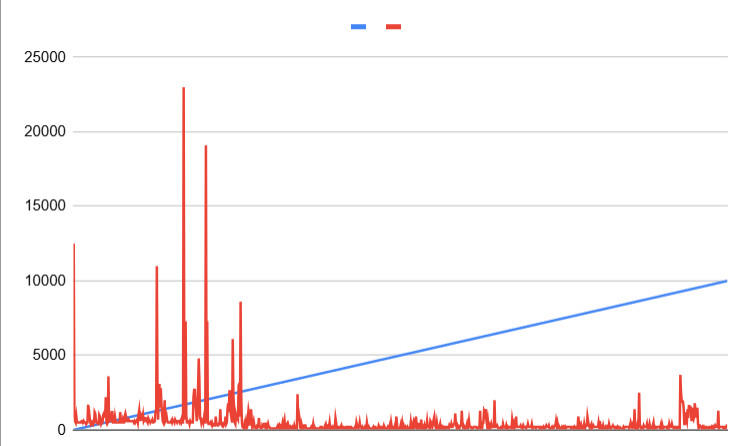

# Questions

### WK2 - Linked Lists

**What is the difference between a singly linked list and a circularly linked list?**
* A singly linked list is a list of items where each item points to the next one, and the last item points to nothing (null).
* A circularly linked list is a list where the last item points back to the first item instead of stopping. The list goes around in a loop.

**In what situations would you prefer to use a linked list to an array?**
* You would prefer to use a linked list instead of an array when the size of the collection needs to change often and when elements are frequently inserted or removed. Also, when you do not need fast access by index.

**Describe two possible use-cases for a circularly linked list** 
* Round-robin scheduling:
A circularly linked list is useful when several tasks need to take turns. After the last task is done, the list goes back to the first task automatically, so the cycle can continue smoothly.
* Playlists or turn-based games:
A circularly linked list is helpful when items repeat in order, like songs in a playlist or players taking turns in a game. When you reach the end, it loops back to the start without stopping.

### WK3 - Stacks, Queues, Deque

**Write the pseudocode for an algorithm which implements a Queue using two stacks.
Provide implementations for the enqueue() and dequeue() methods.**

    PROCEDURE enqueue(x)
    PUSH x onto Stack1

    dequeue():
    if outStack is empty:
        if inStack is empty:
            return "Queue is empty"
        while inStack is NOT empty:
            outStack.push(inStack.pop())
    return outStack.pop()    

**Write the pseudocode algorithm which reverses the elements on a Stack using two additional Stack's (no other data structures are allowed)**

Stack A,
Stack B,
Stack C

    while C is not empty:
        A.push(C.pop())

    while A is not empty:
        B.push(A.pop())

    while B is not empty:
        C.push(B.pop())

### WK4 - Trees I

**Write a recursive function (pseudocode) to count the number of external nodes in a binary tree.**

    countExternal(p):
    if isExternal(p):
    return 1
    return countExternal(left(p)) + countExternal(right(p))

    public int countExternal(Position<E> p) {
        if (isExternal(p)) return 1;
        return countExternal(left(p)) + countExternal(right(p));
    }

**Describe, with a figure or pseudocode, an algorithm which counts only the left external
nodes in a binary tree.**

        A
       / \
      B*  C
     / \
    D*  E
    
    Nodes Marked * are left external nodes.

**Consider a binary tree, where each node holds a single character. The nodes, in no
particular order, are ['A', 'E', 'F', 'M', 'N', 'U', 'X'].**

**Draw a representation of this binary tree such that a preorder traversal of the tree gives
the result: "EXAMFUN"**

        E
        \
        X
        /
        A
        \
        M
        /
        F
        \
        U
        /
        N

**Draw a representation of this binary tree such that an inorder traversal of the tree gives
the result: "EXAMFUN".**

         M
        / \
       A   U
      / \ / \
     E  X F  N

**Draw a representation of this binary tree such that a postorder traversal of the tree
gives the result: "EXAMFUN".**

           M
          / \
         X   U
        / \ / \
       E  A F  N

**Write the pseudocode for an algorithm which counts the total number of descendants of
a node in a binary tree.**

    countDescendants(p):
    if isExternal(p):  return 0
    left  ← 1 + countDescendants(left(p))
    right ← 1 + countDescendants(right(p))
    return left + right

### WK5 - Trees II
**Describe a method (using pseudocode) to find the diameter of a binary tree.**

    diameter(root):
    result ← 0
    diameterHelper(root, result)
    return result

    diameterHelper(node, result):
    if node is null: return -1
    left  ← diameterHelper(node.left,  result)
    right ← diameterHelper(node.right, result)
    path  ← left + right + 2
    if path > result: result ← path
    return 1 + max(left, right)

**Write a function which creates random binary trees for size n = [50, 5000] in steps of 50.
For each size n, generate 100 different random binary trees of size n and compute the
average of their height. Plot the average height as a function n**

The plot confirms O(log n) average height scaling for random binary trees.

### WK6 - Recursion
**Write the pseudocode for a recursive function which prints the elements of a linked
list in reverse?**

    if node == null
        return

    printReverse(node.next)
    print node.element

**Write the pseudocode for a fully recursive function which copies a linked list?**
  
    if node == null
        return null

    newNode = new Node(node.data)
    newNode.next = copyList(node.next)
    return newNode

**What do you expect the complexity T(n) of the inorder method of the LinkedBinaryTree
to be?**

Expected complexity: O(n) inorder visits every node exactly once,
so execution time should grow linearly with n.

### WK 7 - Priority Queues

**Illustrate the execution of the heap.insert() method on the following input:
[2, 5, 16, 4, 10, 23, 39, 18, 26, 15]
For this question, draw the valid heap after each call to heap.insert().**

    Insert 2:  [2]
    Insert 5:  [2, 5]
    Insert 16: [2, 5, 16]
    Insert 4:  [2, 5, 16, 4] → 4 < 5, swap → [2, 4, 16, 5]
    Insert 10: [2, 4, 16, 5, 10] → 10 > 4, no swap
    Insert 23: [2, 4, 16, 5, 10, 23] → 23 > 16, no swap
    Insert 39: [2, 4, 16, 5, 10, 23, 39] → 39 > 16, no swap
    Insert 18: [2, 4, 16, 5, 10, 23, 39, 18] → 18 > 5, no swap
    Insert 26: [2, 4, 16, 5, 10, 23, 39, 18, 26] → 26 > 5, no swap
    Insert 15: [2, 4, 16, 5, 10, 23, 39, 18, 26, 15] → 15 > 10, no swap

**List the nodes in the preorder traversal of the heap constructed from this array:
PreOrder [2, 5, 16, 4, 10, 23, 39, 18, 26, 15]**
    
    2, 4, 5, 18, 26, 10, 15, 16, 23, 39

**List the nodes in postorder traversal of the heap constructed from this array:
PostOrder [2, 5, 16, 4, 10, 23, 39, 18, 26, 15]**

    5, 4, 18, 10, 15, 26, 16, 2, 23, 39

**Can you construct a valid heap where a pre-order traversal of the keys does not list them
descending order?
Can you construct a valid heap where a post-order traversal of the keys does not list
them ascending order?**

Yes, A heap only guarantees that each parent node is larger than its children (in a min-heap). It does not guarantee ordering between subtrees. Therefore, a pre-order traversal does not necessarily list keys in descending order.
   
    Preorder : [100, 50, 20, 40, 80, 60, 70]
    Postorder : [20, 40, 50, 60, 70, 80, 100]

### WK 8 - HashMaps

**Draw the 11-entry hash table that results from using the hash function,
h(i) = (3i + 5) mod 11 (1)
to hash the keys 12, 44, 13, 88, 23, 94, 11, 39, 20, 16, and 5, assuming collisions are
handled by separate chaining.**

    Slot     Chain

      0      [13]
      1      [94] → [39]
      2      null
      3      null
      4      null
      5      [44] → [88] → [11]
      6      null
      7      null
      8      [12] → [23]
      9      [16] → [5]
     10      [20]

**Draw the 19-entry hash table that results from using the default MAD hash function
in AbstractHashMap to hash the keys 12, 44, 13, 88, 23, 94, 11, 39, 20, 16, and 5,
assuming collisions are handled by separate chaining.**

    Slot      Chain
   
      0       [44]
      1       [5]
      2       [12]
      3       [88] → [39] → [16]
      4       [23]
      5       null
      6       [11]
      7       null
      8       [94]
      9       null
     10       [13]
     11       [20]
     12       null
     13       null
     14       null
     15       null
     16       null
     17       null
     18       null